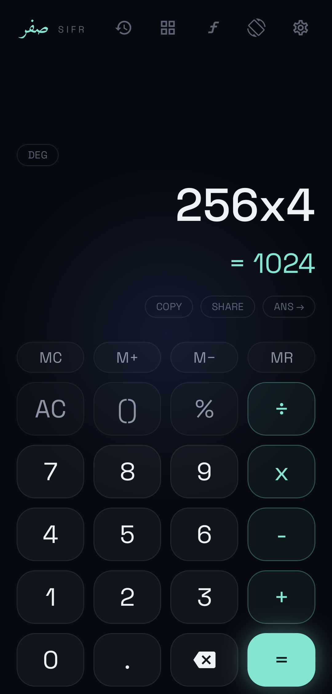
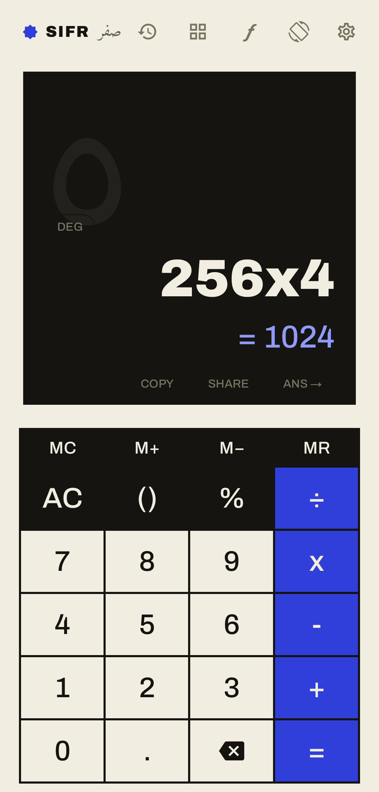
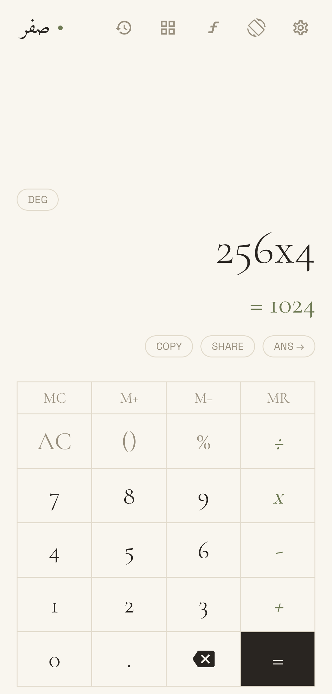
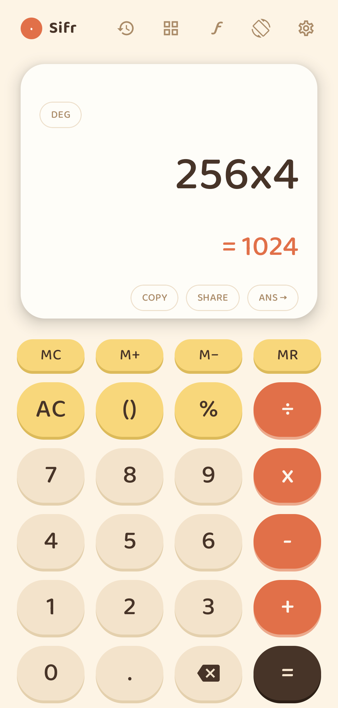
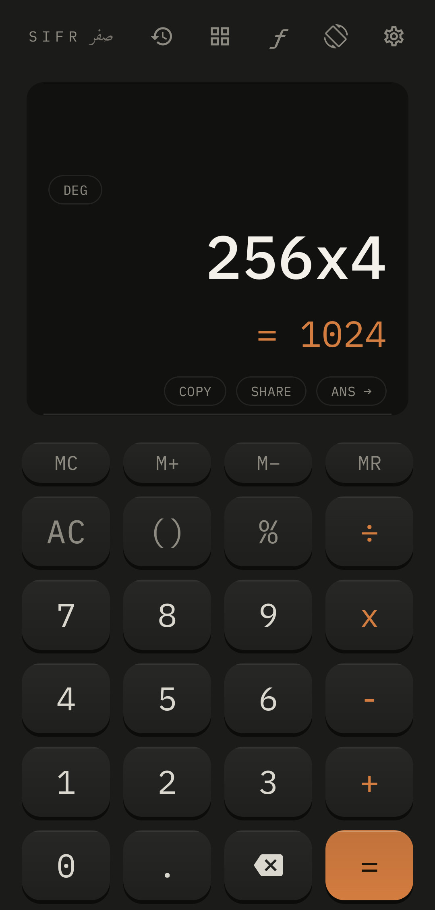
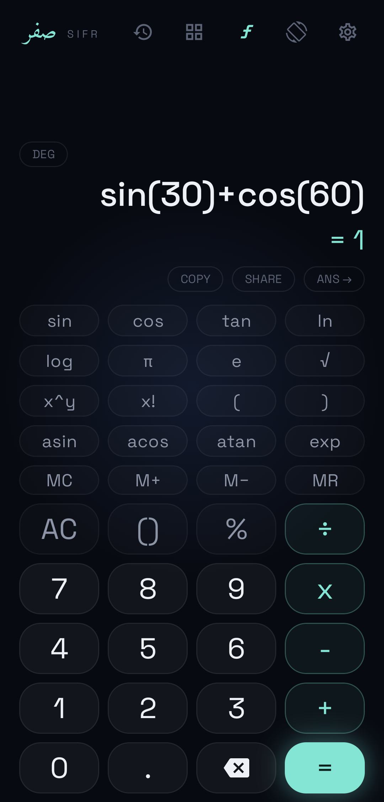
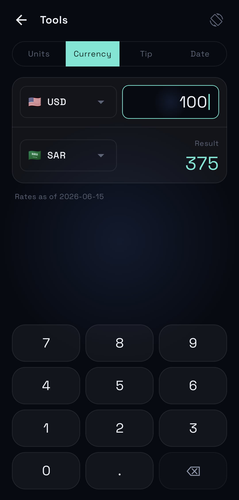
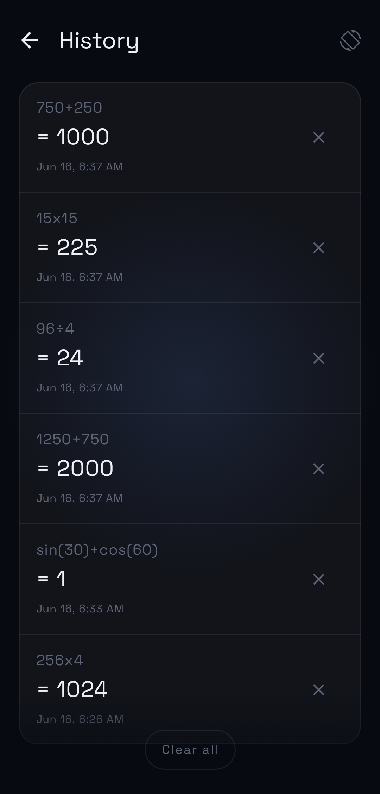
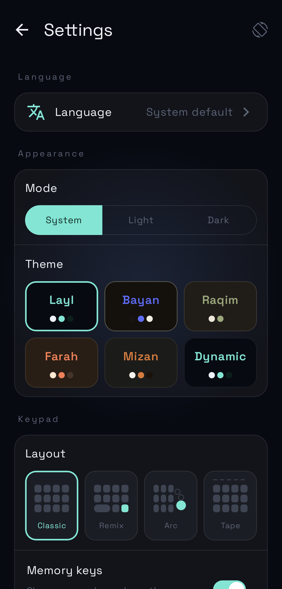

# Sifr (صفر)

A modernized, deeply customizable Material 3 calculator for Android — published on the Google Play Store. Basic + scientific calculation, built-in converters, five hand-crafted palettes, and full right-to-left support across 11 languages. Named after the Arabic word for "zero" (the root of the English word "cipher" and the foundational concept of digital computing).

[](https://play.google.com/store/apps/details?id=com.gaddal.materialcalculator)
[](./CHANGELOG.md)


## Screenshots

**Five hand-crafted palettes** — each with light & dark variants, plus Material You.

<table>
  <tr>
    <td></td>
    <td></td>
    <td></td>
    <td></td>
    <td></td>
  </tr>
  <tr align="center">
    <td><b>Layl</b><br><sub>neon-teal glass</sub></td>
    <td><b>Bayan</b><br><sub>ink color-block</sub></td>
    <td><b>Raqim</b><br><sub>editorial serif</sub></td>
    <td><b>Farah</b><br><sub>playful pills</sub></td>
    <td><b>Mizan</b><br><sub>machined keys</sub></td>
  </tr>
</table>

**Scientific mode, built-in tools, history, and full Arabic (RTL).**

<table>
  <tr>
    <td></td>
    <td></td>
    <td></td>
    <td></td>
    <td></td>
  </tr>
  <tr align="center">
    <td>Scientific</td>
    <td>Tools</td>
    <td>History</td>
    <td>Settings</td>
    <td>العربية</td>
  </tr>
</table>

## Features

**Calculation**
- Basic + scientific modes (toggle from the toolbar)
- Functions: `sin`, `cos`, `tan`, `asin`, `acos`, `atan`, `ln`, `log`, `√`, `exp`
- Constants: `π`, `e`
- Operators: `+`, `−`, `×`, `÷`, `%`, `^` (right-associative power), `!` (factorial)
- Angle unit toggle: degrees ⇄ radians
- Implicit multiplication: `5sin(30)`, `πe`, `2(3+1)` all parse as expected
- IEEE-754 precision cleanup: `sin(30°) = 0.5`, `sin(π) = 0` (no trailing noise)
- Recursive-descent expression evaluator with operator precedence, parentheses, and unary minus

**Editing**
- Editable cursor — tap anywhere in the expression to position the cursor
- Range selection + Copy
- Live result preview while typing
- Auto-shrinking font for long expressions; one-tap "smart delete" peels whole function tokens (`sin(` → empty)

**Memory + history**
- Memory keys: `MC`, `M+`, `M−`, `MR`
- M-chip indicator when memory is non-empty
- Calculation history (Room-backed) — tap any past row to restore the expression

**Tools** (⊞ from the toolbar)
- Currency converter — live rates with an offline-first cache and bundled seed rates; searchable picker with flags
- Unit converter — length, weight, temperature, data
- Tip & split — preset percentages, per-person split
- Date calculator — difference between dates and add-days

**Themes & personalization**
- Five hand-crafted palettes — Layl, Bayan, Raqim, Farah, Mizan — each with light & dark variants
- Material You dynamic color
- Mode: light, dark, or follow-system
- Four keypad layouts: Classic, Remix, Arc, Tape
- Optional memory-key row

**Settings**
- In-app language switch (live, no restart) with a universal language anchor on the row
- Haptic feedback toggle (intent-based, not per-press)
- Error-sound toggle
- All preferences persisted via DataStore

**Form factor + locale**
- Adaptive landscape layout — scientific + basic blocks side by side
- Immersive landscape mode + an in-app rotate toggle
- 11 languages — English, Arabic, Spanish, Portuguese (BR), French, German, Indonesian, Turkish, Italian, Vietnamese, Russian
- Full right-to-left (RTL) coverage — interface, errors, in-app strings
- Five distinct localized error types (division by zero, invalid expression, function domain, overflow, syntax)

See [`CHANGELOG.md`](./CHANGELOG.md) for the per-release breakdown.

## Tech stack

- **Language:** Kotlin 2.3.21
- **UI:** Jetpack Compose, Material 3 (BOM 2026.05.00)
- **Architecture:** MVI with unidirectional data flow (`State` / `Action` / `Event`)
- **DI:** Koin 4.2.1
- **Navigation:** Jetpack Navigation 3 (1.1.1)
- **Persistence:** Room 2.8.4 (history) + DataStore 1.2.1 (settings)
- **Feedback:** Pulsar 1.1.0 (haptics + sound)
- **Build:** Gradle 9.5.0, AGP 9.2.1, JDK 21 toolchain (declarative via `gradle/gradle-daemon-jvm.properties`), Java 17 target
- **Build scripts:** Kotlin DSL with version catalog (`gradle/libs.versions.toml`)
- **Testing:** JUnit 4, Google Truth, Turbine, Espresso

## Project structure

Single-module Gradle project — namespace `dev.gaddal.sifr`, applicationId `com.gaddal.materialcalculator` (intentionally distinct to preserve the live Play Store listing). Layered packages inside `:app`:

- **`core/`** — cross-feature primitives
  - `data/` — Room database, DataStore-backed `SettingsRepository`, cross-feature `CalculatorInputBus`
  - `domain/` — `Result<D, E>`, `CalcError`, `UiText`, settings models
  - `ui/` — theme, navigation routes, feedback controller, reusable UI utilities
- **`feature/`** — user-facing surfaces, each with its own `domain` + `ui` packages
  - `calculator/` — `ExpressionWriter`, `ExpressionParser`, `ExpressionEvaluator`, `CalculatorViewModel`, the keypad + display composables
  - `history/` — Room-backed history list + tap-to-restore
  - `settings/` — theme picker + feedback toggles

The calculation pipeline is one-shot per `=` press: UI emits a `CalculatorAction`, `ExpressionWriter` mutates the raw expression string (also handling cursor + range selection + implicit multiplication + smart delete), `ExpressionParser` tokenizes it into `ExpressionPart`s (numbers, ops, constants, function names, postfix `!`), and `ExpressionEvaluator` evaluates with a hand-written recursive-descent grammar:

```
expression → term (± term)*
term       → factor (×|÷|% factor)*
factor     → power
power      → unary (^ power)?        // right-associative
unary      → -unary | postfix
postfix    → primary (!)*
primary    → number | constant | function(expression) | (expression)
```

For deeper architecture notes and conventions see [`CLAUDE.md`](./CLAUDE.md).

## Build

The project uses the Gradle wrapper. From the repo root:

```bash
# Debug APK
./gradlew :app:assembleDebug

# Install on connected device
./gradlew :app:installDebug

# All unit tests
./gradlew test

# Single test class
./gradlew :app:testDebugUnitTest --tests "dev.gaddal.sifr.feature.calculator.domain.ExpressionEvaluatorTest"

# Lint
./gradlew :app:lintDebug

# Signed release AAB (requires keystore in local.properties)
./gradlew :app:bundleRelease
```

### Build variants

Three build types: `debug`, `staging`, `release`. Staging carries `applicationIdSuffix .staging` so it installs alongside the production build.

`local.properties` (gitignored) defines `keystore.file`, `keystore.password`, `keystore.alias`, `keystore.alias_password` for release signing. The build script wraps the read in `runCatching`, so missing or malformed `local.properties` (or just missing the `keystore.*` keys) only blocks release/staging signed builds — debug builds work without the keystore lines as long as `sdk.dir` (or `ANDROID_HOME` env var) is present.

## Branching

```
feature/* → development → master
```

Work happens on `feature/<name>` branches off `development`. `master` is production-only and ships to Play Store; tags are cut from `master` only (e.g. `v1.3.0`). A `staging` branch + `staging` build variant exist in the build config and will be activated once CI is wired (planned for an upcoming phase).

## Roadmap

**Shipped to Play**
- **v1.2.0** (2026-05-09) — Phase 1: toolchain modernization, Material 3 dynamic color, edge-to-edge, error handling, Android 16 target SDK
- **v1.3.0** (2026-05-12) — Phase 2.0 → 2.10: Sifr rebrand, MVI + Koin + Nav3 architecture, Settings, History, scientific mode + memory keys, adaptive landscape, editable cursor + live preview, haptic + sound feedback, typed errors with full EN + AR localization

**Done in-repo, batched for the v2.0 cut**
- Full visual redesign — five hand-crafted palettes + Material You, four keypad layouts, redesigned display with an in-line result tape
- Tools — currency (live + offline), unit, tip & split, and date converters
- History redesign — result-grouped rows, tap-to-restore, pinned clear-all
- Internationalization to 11 languages with an in-app live language switch (no restart)

**Coming**
- Google Play listing assets (icon, feature graphic, screenshots) and the v2.0 release
- GitHub Actions CI/CD (then activating the `development → staging → master` flow)
- Signed release / staging builds

## Author

Built by [Hussain Gaddal](https://github.com/IronManYG).
